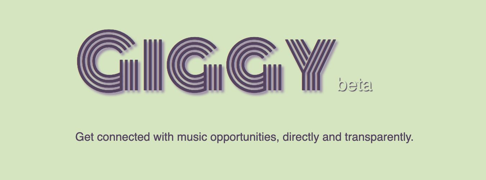
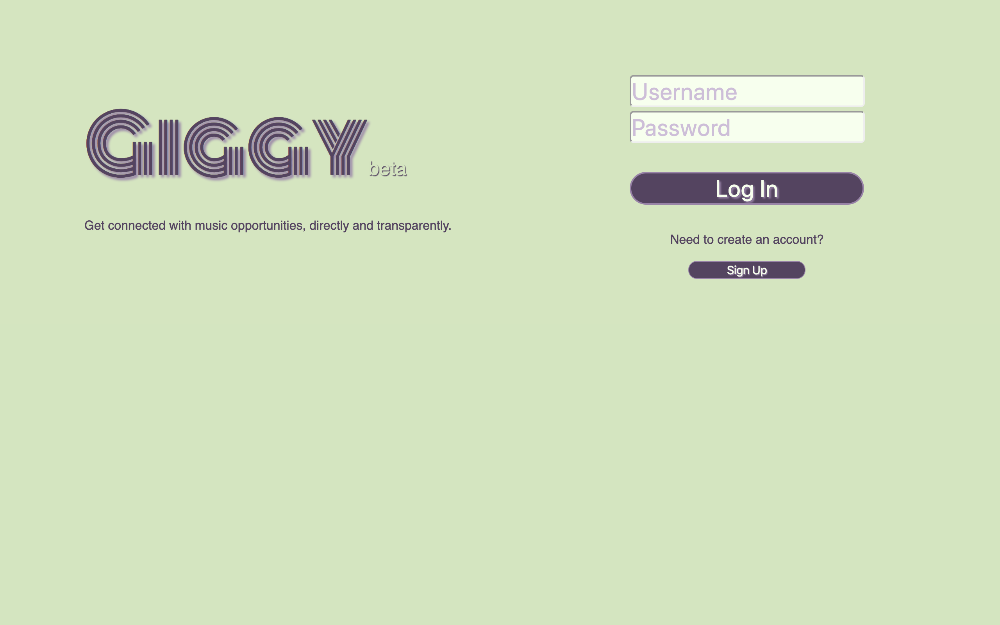
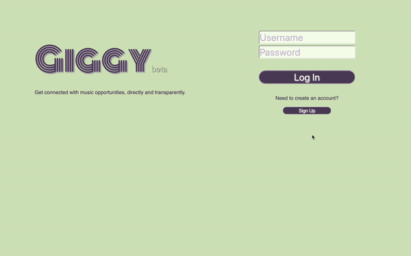
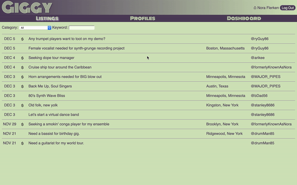
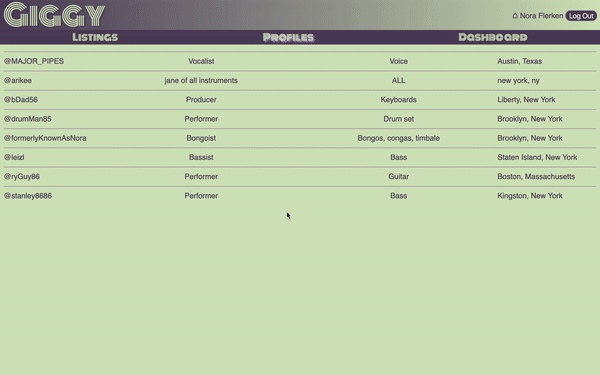
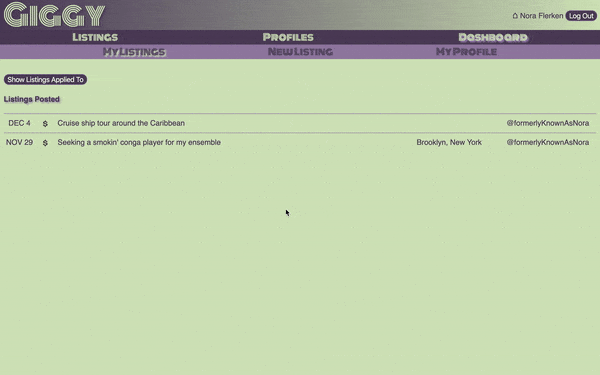

Giggy is an app for musicians to post, browse, search, and apply to listings for music opportunities.
It is a project application done for module 5 of Flatiron School. Besides smoothing up existing 
features, refactoring certain code blocks, and seeking out bugs, the main to-dos are:
  - implement user-to-user messaging
  - add custom validation error messages
  - enhance search and filter options
  - beautify show pages

## Frontend Repository
  - [Giggy Client](https://github.com/dangrammer/giggy-frontend)

## Ruby Version
  - ruby 2.6.1

## Rails Version
  - rails ~> 6.0.1

## Database
  - postgreSQL

## Gem Dependencies
  - fast_jsonapi
  - rack-cors
  - bcrypt ~> 3.1.7
  - jwt ~> 2.2, >= 2.2.1
  - dotenv-rails

## Live Demo
  Link to walkthrough video with narration:
  <br/>
  <a href="https://www.youtube.com/watch?v=qJu9ODluSp4&feature=youtu.be" target="_blank">
    <!--  -->
    
  </a>  

## Screenshots

  Login/Signup
  <br/>
  

  Listings
  <br/>
  

  Profiles
  <br/>
  

  Dashboard
  <br/>
  


## How To Install and Run

  1. fork (optional) then clone or download this repository to local machine
  2. use text editor and/or terminal to navigate into `giggy-backend` directory
  3. run `bundle install` (or `bundle i`) in terminal to install necessary dependencies
  4. run `rails db:create` in terminal to create database
  5. run `rails db:migrate` in terminal to initialize database
  6. create secret keys:
    - create a `.env` file in root directory
    - write secret keys for JWT and seed passwords in `.env` file:
      ```
      JWT_SECRET_KEY=KEY_HERE
      SEED_PASSWORD_1=KEY_HERE
      SEED_PASSWORD_2=KEY_HERE
      SEED_PASSWORD_3=KEY_HERE
      ```
    *_Note: `KEY_HERE` should be characters of your choice and seed passwords are_
    _optional. If seed passwords are not used, delete them from the `.env` file_
    _and change passwords for users 1, 2, and 3 in `db/seeds.rb` file._
  7. run `rails db:seed` in terminal to seed database with starter data
  8. run `rails s` in terminal to run server in browser at http://localhost:3000/
  9. install and run [Giggy frontend](https://github.com/dangrammer/giggy-frontend)
